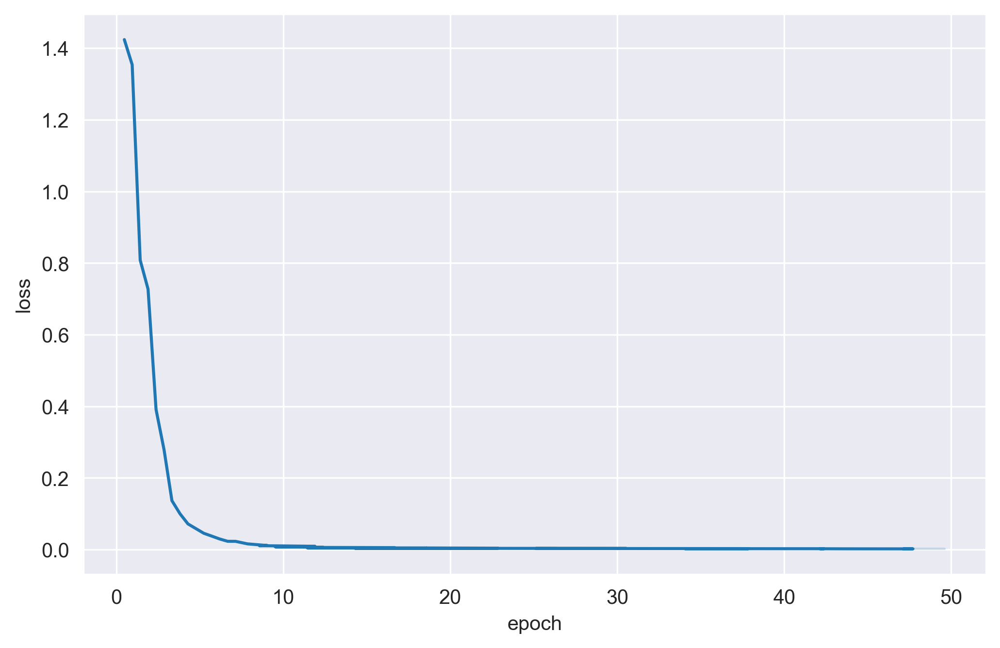

[**中文**](./README.md) | [**English**](./README_en.md)

# 司空：基于中文建筑行业知识的LLaMA和Alpaca微调大模型

### SiKong：Tuning LLaMA and Alpaca Model With Chinese Architecture Instructions


[](https://github.com/SCIR-HI/Huatuo-Llama-Med-Chinese/blob/main/LICENSE) 

本项目开源了经过中文建筑学指令精调/指令微调（Instruct-tuning）的LLaMA-7B模型。我们通过采集建筑行业数据集，对LLaMA进行了指令微调，提高了LLaMA在建筑领域的问答效果。

目前我们只开放针对基础建筑行业知识的模型参数。在未来，我们计划添加更多领域的建筑专业数据集（中式古建筑、建筑行业规范和标准、外国古建筑、建筑结构等），针对不同建筑领域和建筑类型训练模型。

## 1. 更新日志
- Web Demo 体验地址 [sikong](http://region-9.seetacloud.com:33955/)


## 2. A Quick Start

1.  本地克隆`sikong`项目仓库

```shell
# github 仓库
git clone https://github.com/SikongSphere/sikong.git

# gitee 仓库
git clone https://gitee.com/sikongsphere/sikong.git
```

2.  创建虚拟环境并安装第三方库

请确保本地已经安装`conda`且可用， 并根据如下命令创建环境
```shell
conda env create -f environment.yaml
```

3.  下载托管在`huggingface`的建筑领域语言大模型`sikong`，并放置在`model`文件夹内

已进行微调的模型：
 - [sikong-llama-7b-chinese](https://huggingface.co/SikongSphere/sikong-llama-7b-chinese/tree/main)
 - [sikong-alpaca-7b-chinese](https://huggingface.co/SikongSphere/sikong-alpaca-7b-chinese/tree/main)
```shell
cd model

# Make sure you have git-lfs installed (https://git-lfs.com)
git lfs install
git clone https://huggingface.co/SikongSphere/sikong-llama-7b-chinese

# if you want to clone without large files – just their pointers
# prepend your git clone with the following env var:
GIT_LFS_SKIP_SMUDGE=1
```

4. 启动聊天界面
```shell
./scripts/run_app.sh
```

启动服务后，可以打开`127.0.0.1:6006`查看聊天界面。若想替换模型，可以在`run_app.sh`中更改模型的路径。


## 5. 数据集构建
`sikong`建筑领域大模型对于输入数据的要求格式如下所示：
```json
{
    "type": "text2text",
    "instance": [
        {
            "input": "建筑艺术创作中的核心问题是什么？",
            "output": "建筑的空间与实体，是对立统一的两个方面，抓住它并认真地去剖析，运用一定的构图技法把它解决好，则是建筑艺术创作中非常重要的核心问题。"
        }
    ]
}
```
为方便用户录入数据并转换为目标`json`格式，我们提供了格式转换的脚本，其位置位于`scripts/data_preprocess/csv2json.py`，具体用法为：
```python
python scripts/data_preprocess csv2json.py --csv data/example.csv --json data/example.json
```
需要注意的是，在转换`json`数据后，需要利用`script/add_end_mark.py`对其添加停用词。

## 6. Finetune
如果用户需要对模型进行微调，可以使用如下命令：
```shell
./scripts/run_finetune.sh
```
可在`run_finetune.sh`文件中更改具体参数，以符合具体需求。

## 7.训练细节


### 7.1. 计算资源需求
`sikong`训练资源:

 - `GPU`: `A100-PCIE-40GB` * 4卡
 - `CPU`: `40 vCPU Intel Xeon Processor (Skylake, IBRS)`
 - `内存` 288GB


### 7.2. 实验过程


## 8. 模型效果对比

| 测试输入        | Llama输出 | Alpaca输出 | SiKong司空输出 |
|:------------| :-------- | :--------- | :------------- |
| 请介绍一下变形缝的概念。|           |            |变形缝是指将建筑物垂直分开的预留缝。由于温度变化、地基不均匀沉降和地震因素的影响，易使建筑物发 生裂缝或破坏，故在设计时应事先将房屋划分成若干个独立的部分，使各部分能自由地变化。               |
|             |           |            |                |
|             |           |            |                |


## 9. 常见问题

1. Q：

   A：

2. Q：

   A：

3. Q：

   A：

4. Q：

   A：

5. Q：

   A：

## 10. 项目参与者

本项目由司空学社的刘钧文、梁超完成。

## 11. Star History


## 12. 致谢

- 感谢王非先生对本项目的资金支持。

## 13. 免责声明

本项目相关资源仅供学术研究之用，严禁用于商业用途。使用涉及第三方代码的部分时，请严格遵循相应的开源协议。模型生成的内容受模型计算、随机性和量化精度损失等因素影响，本项目无法对其准确性作出保证。本项目数据集绝大部分由模型生成，即使符合某些建筑学事实，也不能被用作实际建筑设计的依据。对于模型输出的任何内容，本项目不承担任何法律责任，亦不对因使用相关资源和输出结果而可能产生的任何损失承担责任。

## 14. Citation

如果你使用了本项目的数据或者代码，请声明引用


## 15. 合作单位


